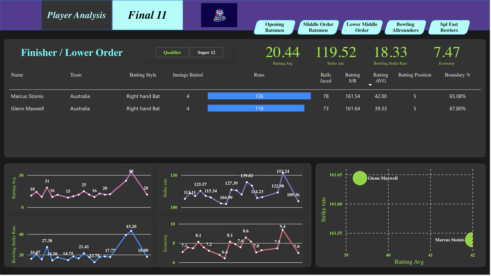

# Cricket Data Analytics for the Best 11 Players [Click Here!](https://app.powerbi.com/view?r=eyJrIjoiNzQyMTBjYzUtNGZmZC00ZTA0LWI4NDItNTJmN2Q4Mzg2NTQ4IiwidCI6ImE2YWZkNmQ0LWJiMzctNGNkMC05MWZkLTk0MGQzNDFmMDIxYyJ9)

This Power BI project analyzes cricket data from the World Cup T20 to determine the best 11 players based on various performance metrics. 

## Data Source and Web Scraping

The data for this project was web-scraped using Brightdata, from the [International Cricket Council (ICC) website](https://www.icc-cricket.com/). The data includes information on player statistics, match results, and tournament details for the World Cup T20 tournaments.

## Data Cleaning and Analysis

The data was cleaned and transformed using Python Pandas and Power Query to prepare it for analysis. The data was then modeled using DAX and analyzed using various Power BI visualizations and reports to identify the top 11 players based on various performance metrics such as batting and bowling averages, strike rates, and boundary and dot-ball percentage.

## Results

The final results of the analysis are presented in a Power BI report, showcasing the top 11 players based on the selected performance metrics. The report also includes interactive visualizations that allow users to explore the data and understand the underlying trends and patterns.

## Getting Started

To view the report, you will need to have Power BI Desktop installed on your computer. You can download Power BI Desktop from the [Microsoft website](https://powerbi.microsoft.com/). Once you have Power BI Desktop installed, simply open the `.pbix` file in the repository and start exploring the data and visualizations.

## Overview

## 1) Opener Analysis

## 2) Middle Order Analysis

## 3) Finisher Analysis

## 4) Bowling Allrounder Analysis

## 5)Specialist Fast Bowler Analysis

## Stats Tooltip on hovering over the player

## And Finally, the Final 11

We have a wicketkeeper in the best 11, fortunately. Else we could have made a slightly different team selection.

## Acknowledgments

- [International Cricket Council (ICC) website](https://www.icc-cricket.com/) for providing the data used in this project.
